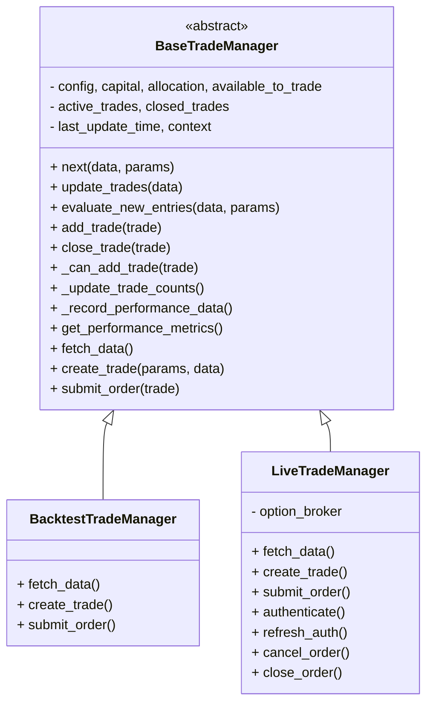

# Refactoring Plan (Updated)

**Version:** 0.9.17  
**Date:** 2025-04-09  
**Summary:** Updated after reviewing `base_backtest.py` and `bot.py` orchestrators.

---

## Objective

Unify the core trade management logic of **backtesting** (`OptionBacktester`) and **live trading** (`TradingManager`) into a **shared, maintainable architecture** while **preserving existing workflow orchestrators**.

---

## Key Insights from Additional Files

- **`BaseBacktest`** orchestrates backtesting by managing data loading and calling an `OptionBacktester` instance.
- **`bot.py`** orchestrates live trading by managing config, authentication, and calling a `TradingManager` instance.
- Both **rely on their respective trade manager classes** but **do not inherit from them**.
- Therefore, **trade management logic should be unified**, but **workflow orchestration remains separate**.

---

## Updated Design

---

## Implementation Steps

1. **Create `BaseTradeManager` (abstract base class)**
   - Contains **core trade management logic**.
   - Defines **template `next()` method**:
     - Calls `update_trades()`
     - Calls `evaluate_new_entries()`
   - Abstracts:
     - `fetch_data()`
     - `create_trade()`
     - `submit_order()`

2. **Refactor `OptionBacktester` into `BacktestTradeManager`**
   - Inherits from `BaseTradeManager`.
   - Implements:
     - `fetch_data()` for historical data
     - `create_trade()` for simulated trades
     - `submit_order()` as no-op or logging

3. **Refactor `TradingManager` into `LiveTradeManager`**
   - Inherits from `BaseTradeManager`.
   - Implements:
     - `fetch_data()` for live data
     - `create_trade()` for live orders
     - `submit_order()` to broker
   - Adds broker-specific methods (auth, cancel, etc.)

4. **Update orchestrators:**
   - `BaseBacktest` to instantiate `BacktestTradeManager` instead of `OptionBacktester`.
   - `bot.py` to instantiate `LiveTradeManager` instead of `TradingManager`.
   - Minimal changes needed due to compatible APIs.

---

## Benefits

- **Centralizes shared logic** for maintainability.
- **Reduces duplication** between backtesting and live trading.
- **Preserves existing workflow orchestration**.
- **Allows easy extension** for new trade types, brokers, or data sources.
- **Unifies the `next()` method** pattern across modes.

---

## Versioning & Next Steps

- **Version updated to 0.9.17** to reflect this refined plan.
- **Commit this updated plan** before proceeding with implementation.
